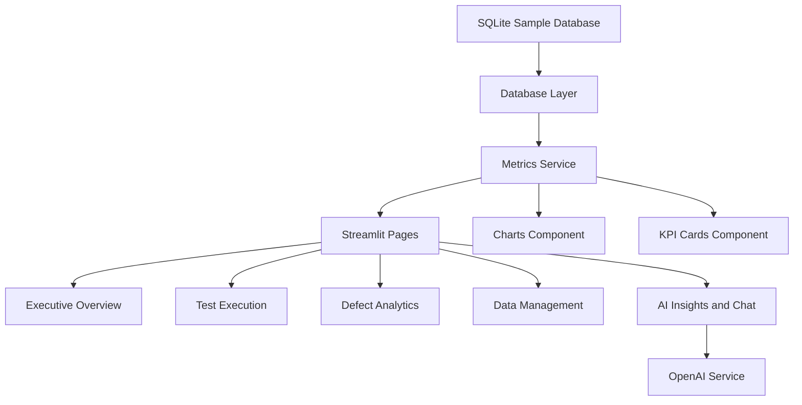

# QA Reporting Framework with AI Analysis and Chatbot

A ready-to-run Streamlit framework for QA program reporting with SQLite sample data, plus OpenAI-powered executive analysis and dashboard chat.

## Included metrics

- Number of test cases
- Test execution
- Pass rate
- Defect status
- Error discovery rate
- Scope coverage
- Number of defects found
- Defects by severity, cycle, and root cause
- Alerts panel
- AI-generated executive analysis
- QA chatbot grounded on the dashboard dataset

## Project structure

```text
qa_reporting_framework_ai/
├── app.py
├── config.py
├── requirements.txt
├── README.md
├── components/
│   ├── ai_panels.py
│   ├── charts.py
│   └── kpi_cards.py
├── database/
│   ├── db.py
│   ├── qa_reporting.db   # auto-created at runtime
│   └── schema.sql
├── pages/
│   ├── 1_Executive_Overview.py
│   ├── 2_Test_Execution.py
│   ├── 3_Defect_Analytics.py
│   ├── 4_Data_Management.py
│   └── 5_AI_Insights_Chat.py
├── services/
│   ├── metrics_service.py
│   └── openai_service.py
└── utils/
    └── sample_data.py
```

## Run locally

```bash
pip install -r requirements.txt
export OPENAI_API_KEY="your_api_key_here"   # macOS/Linux
set OPENAI_API_KEY=your_api_key_here         # Windows cmd
$env:OPENAI_API_KEY="your_api_key_here"     # PowerShell
streamlit run app.py
```

## How the AI features work

### AI Analysis
Generates a leadership-ready summary covering:
- Executive overview
- Key risks
- Strengths
- Release-readiness posture
- Recommended next actions
- Notable anomalies

### QA Copilot Chat
Lets users ask natural-language questions such as:
- Which cycle is riskiest?
- Why is pass rate low?
- What is blocking release readiness?
- Which root causes are driving the most defects?

The chatbot is grounded on the dashboard dataset loaded from SQLite at runtime.

## Calculation Logic

The key calculations happen in `services/metrics_service.py` using data from:
- `test_execution` table for execution and scope metrics
- `defects` table for defect totals and severity counts

Calculated KPI values:
- `total_test_cases`: sum of `planned_test_cases`
- `executed_test_cases`: sum of `executed_test_cases`
- `pass_rate_pct`: `(total_passed / total_executed) * 100`
- `execution_rate_pct`: `(total_executed / total_test_cases) * 100`
- `error_discovery_rate_pct`: `(total_defects / total_executed) * 100`
- `scope_coverage_pct`: average of `scope_executed_pct` across cycles
- `total_defects`: count of rows in the `defects` table
- `closed_defects`: count of defects where `status == "Closed/Deferred"`
- `deferred_tests`: sum of `deferred_test_cases`
- `severity_critical`, `severity_high`, `severity_medium`, `severity_low`: counts of defects grouped by `severity`

Derived datasets prepared for charts and tables:
- `defects_per_cycle`: defects grouped by `cycle_name` and `severity`
- `defect_status`: defects grouped by `status` and `severity`
- `root_cause`: defects grouped by `root_cause`
- `weekly_discovery`: defects grouped by `discovered_week`

## Architecture diagram



## Notes

- The database is auto-initialized on startup.
- Sample data is inserted only when tables are empty.
- The framework is designed so you can swap SQLite for Azure SQL, PostgreSQL, or a Jira/Azure DevOps API later.
- You can provide the OpenAI API key either through an environment variable or the app sidebar for the current session.
